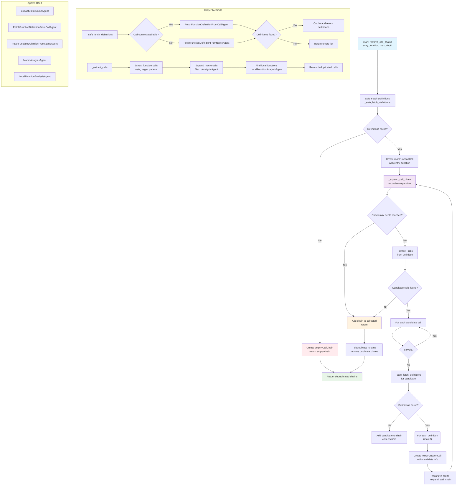

```mermaid
graph TD
    A[Start: retrieve_call_chains<br/>entry_function, max_depth] --> B[Safe Fetch Definitions<br/>_safe_fetch_definitions]
    B --> C{Definitions found?}
    C -->|Yes| D[Create root FunctionCall<br/>with entry_function]
    C -->|No| E[Create empty CallChain<br/>return empty chain]
    D --> F[_expand_call_chain<br/>recursive expansion]
    E --> Z[Return deduplicated chains]
    F --> G{Check max depth reached?}
    G -->|Yes| H[Add chain to collected<br/>return]
    G -->|No| I[_extract_calls<br/>from definition]
    I --> J{Candidate calls found?}
    J -->|No| H
    J -->|Yes| K[For each candidate call]
    K --> L{Is cycle?}
    L -->|Yes| K
    L -->|No| M[_safe_fetch_definitions<br/>for candidate]
    M --> N{Definitions found?}
    N -->|No| O[Add candidate to chain<br/>collect chain]
    N -->|Yes| P("For each definition<br/>(max 3)")
    P --> Q["Create next FunctionCall<br/>with candidate info"]
    Q --> R[Recursive call to<br/>_expand_call_chain]
    R --> F
    H --> S[_deduplicate_chains<br/>remove duplicate chains]
    S --> Z

    subgraph "Helper Methods"
        AA[_safe_fetch_definitions] --> AAA{Call context available?}
        AAA -->|Yes| BBB[FetchFunctionDefinitionFromCallAgent]
        AAA -->|No| CCC[FetchFunctionDefinitionFromNameAgent]
        BBB --> DDD{Definitions found?}
        CCC --> DDD
        DDD -->|Yes| EEE[Cache and return definitions]
        DDD -->|No| FFF[Return empty list]

        GG[_extract_calls] --> HH[Extract function calls<br/>using regex pattern]
        HH --> II[Expand macro calls<br/>MacroAnalysisAgent]
        II --> JJ[Find local functions<br/>LocalFunctionAnalysisAgent]
        JJ --> KK[Return deduplicated calls]
    end

    subgraph "Agents Used"
        U[ExtractCallerNameAgent]
        V[FetchFunctionDefinitionFromCallAgent]
        W[FetchFunctionDefinitionFromNameAgent]
        X[MacroAnalysisAgent]
        Y[LocalFunctionAnalysisAgent]
    end

    style A fill:#e1f5fe
    style Z fill:#e8f5e8
    style E fill:#ffebee
    style H fill:#fff3e0
    style F fill:#f3e5f5
```